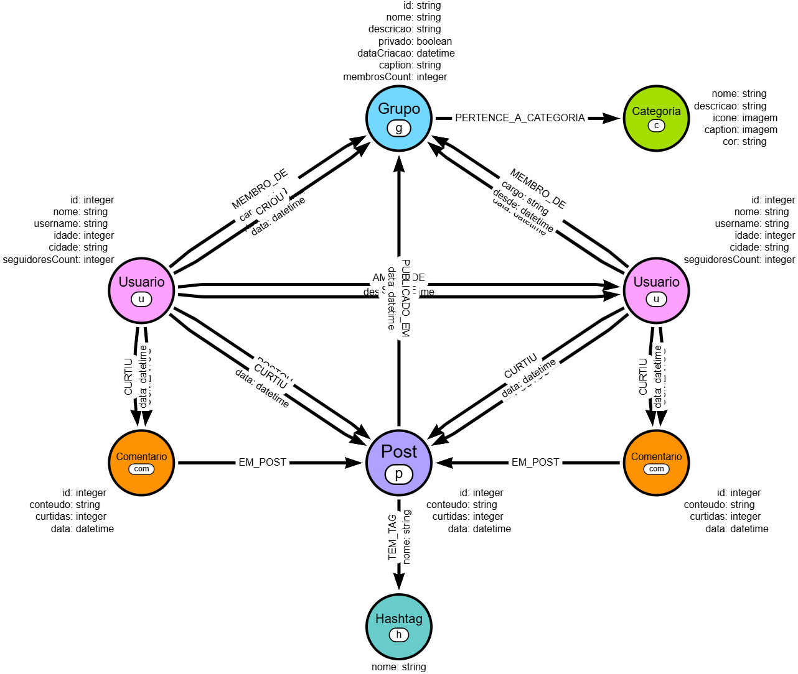

---

## Rede Social com Neo4j - Análise de Dados com Grafos

### 📋 **Índice**

1. [Contexto do Problema](#contexto-do-problema)
2. [Por Que Grafos?](#por-que-grafos)
3. [Arquitetura do Grafo](#arquitetura-do-grafo)
4. [Pré-requisitos](#pré-requisitos)
5. [Instalação e Configuração](#instalação-e-configuração)
6. [Importação de Dados](#importação-de-dados)
7. [Consultas de Exemplo](#consultas-de-exemplo)
8. [Análises Avançadas](#análises-avançadas)
9. [Troubleshooting](#troubleshooting)
10. [Otimização e Performance](#otimização-e-performance)
11. [Próximos Passos](#próximos-passos)

---

## 🎯 Contexto do Problema

### O Desafio
Redes sociais modernas precisam responder perguntas complexas sobre relacionamentos e conexões entre usuários:

- **Descoberta de Conexões**: "Quem são os amigos dos meus amigos?"
- **Influência**: "Quem são os usuários mais influentes da rede?"
- **Recomendações**: "Que conteúdo ou pessoas eu deveria seguir?"
- **Comunidades**: "Quais grupos de usuários compartilham interesses similares?"
- **Propagação**: "Como o conteúdo se espalha pela rede?"
- **Análise de Engajamento**: "Quais posts geram mais interação?"

### Limitações de Bancos Relacionais
Em um banco de dados relacional (SQL), essas consultas se tornam:

❌ **Complexas**: Múltiplos JOINs aninhados  
❌ **Lentas**: Performance degrada exponencialmente com profundidade  
❌ **Difíceis de Escalar**: Cada nível de relacionamento adiciona carga  
❌ **Pouco Intuitivas**: SQL não expressa naturalmente relacionamentos

**Exemplo de Query SQL para "amigos de amigos"**:

```sql
SELECT DISTINCT u3.*
FROM usuarios u1
JOIN amizades a1 ON u1.id = a1.usuario_id
JOIN usuarios u2 ON a1.amigo_id = u2.id
JOIN amizades a2 ON u2.id = a2.usuario_id
JOIN usuarios u3 ON a2.amigo_id = u3.id
WHERE u1.id = 1
  AND u3.id != 1
  AND u3.id NOT IN (
    SELECT amigo_id FROM amizades WHERE usuario_id = 1
  );
```

### O que não pode faltar no seu Repositório Neo4j!
Para que seu projeto seja notado e considerado "Nota 10", o time de especialistas da Neo4j recomenda que você estruture seu repositório com os seguintes itens:

•	**README Estruturado**: Dedique um tempo à documentação. Explique o contexto do problema, justifique a escolha por grafos e deixe instruções claras de execução. ***Dica de ouro***: documente as dificuldades que encontrou (troubleshooting) e como as resolveu. O mercado valoriza profissionais que mostram suas "cicatrizes" de projetos reais!

•	**Modelo do Grafo**: Inclua imagens claras do seu esquema (labels, relacionamentos e propriedades). Você pode desenhar a modelagem usando a ferramenta Arrows.app ou rodar o comando CALL db.schema.visualization() no próprio Neo4j para exportar o visual.

•	**Dataset e Scripts de Carga**: Disponibilize uma amostra dos dados utilizados e inclua as suas queries Cypher comentadas (ex: usando o LOAD CSV).

•	**Queries de Negócio e Evidências Visuais**: Mostre que seu modelo funciona na prática! Liste as perguntas de negócio que seu grafo responde e adicione "prints" das visualizações geradas (você pode usar o Neo4j Browser, Bloom ou Explore) para comprovar os insights.

### Informações adicionais do Instrutor sobre o Desafio

**Contexto do Problema**  
Uma startup de análise de mídias sociais está desenvolvendo um produto para gerar *insights* sobre engajamento e conexões entre usuários em plataformas digitais. O objetivo é criar um protótipo funcional capaz de responder perguntas complexas sobre interações, popularidade de conteúdos e formação de comunidades.

**Desafio Técnico**  
Com base nos conceitos de modelagem de grafos estudados, projete, implemente e consulte um banco de dados Neo4j que represente uma rede social realista. O modelo deve ser otimizado para responder eficientemente às perguntas de negócio — não apenas armazenar dados.

**Princípio Fundamental: Modelagem Orientada a Perguntas**  
Seu grafo deve ser construído *a partir das perguntas que precisa responder*. Cada query define quais *nodes* e *relationships* são essenciais:

| Pergunta de Negócio                          | Elementos do Modelo Necessários                     |
|---------------------------------------------|-----------------------------------------------------|
| "Quem recomendar para seguir?"              | `(:Usuario)-[:SEGUE]->(:Usuario)`, análise de amigos em comum |
| "Qual post foi mais engajado no último mês?"| `(:Post {data, curtidas})`, `(:Usuario)-[:CURTIU {data}]->(:Post)` |
| "Qual a menor distância entre dois usuários?"| `shortestPath((u1)-[:AMIGO_DE*]-(u2))`            |
| "Quais comunidades existem na rede?"        | Algoritmos GDS (Louvain) sobre relacionamentos      |

**Elementos-Chave do Modelo Sugerido**
- **Nodes**: `Usuario`, `Post`, `Comentario`, `Hashtag`, `Grupo`, `Categoria`
- **Relationships**:
  - `(:Usuario)-[:SEGUE]->(:Usuario)`
  - `(:Usuario)-[:AMIGO_DE {desde:date}]->(:Usuario)`
  - `(:Usuario)-[:POSTOU {data:datetime}]->(:Post)`
  - `(:Usuario)-[:CURTIU {data:datetime}]->(:Post)`
  - `(:Post)-[:TEM_TAG]->(:Hashtag)`
  - `(:Usuario)-[:MEMBRO_DE {cargo:string}]->(:Grupo)`

**Diretrizes para Implementação**
1. **Comece pelas queries**: Liste perguntas críticas antes de modelar.
2. **Priorize relacionamentos explícitos**: Evite propriedades como `usuario.seguidores`; prefira `(:Usuario)-[:SEGUE]->(:Usuario)`.
3. **Use dados realistas**: Gere um dataset fictício com 50–100 usuários, 100+ posts e relacionamentos variados (amizades, curtidas, grupos).
4. **Valide com Cypher**: Após a importação, execute queries de exemplo para confirmar que o modelo responde às perguntas originais.
5. **Otimize com índices**: Crie índices nas propriedades usadas em filtros (`username`, `data`, `categoria`).

**Exemplo de Validação**
```cypher
// Recomendação de usuários baseada em amigos em comum
MATCH (eu:Usuario {id: 1})-[:AMIGO_DE]->()-[:AMIGO_DE]->(sugestao)
WHERE NOT (eu)-[:AMIGO_DE|:SEGUE]-(sugestao) AND eu <> sugestao
RETURN sugestao.nome, count(*) AS conexoesEmComum
ORDER BY conexoesEmComum DESC LIMIT 5;
```

Este desafio reforça um princípio central do Neo4j: **o poder do grafo está na modelagem adequada aos padrões de consulta**, não na complexidade dos dados em si. Um modelo simples, mas alinhado às perguntas de negócio, supera modelos densos mal estruturados.

---

## 🚀 Por Que Grafos?

### Vantagens do Neo4j para Redes Sociais

1. **Performance em Relacionamentos**  
   Grafos navegam relacionamentos em tempo constante (O(1)), independente do tamanho do banco.

   **Mesma query em Cypher**:
   ```cypher
   MATCH (eu:Usuario {id: 1})-[:AMIGO_DE]->()-[:AMIGO_DE]->(sugestao)
   WHERE NOT (eu)-[:AMIGO_DE]-(sugestao) AND eu <> sugestao
   RETURN DISTINCT sugestao.nome
   ```
   ✅ Simples e legível  
   ✅ Performance constante  
   ✅ Escalável naturalmente

2. **Modelagem Natural**  
   Grafos espelham a estrutura mental de redes sociais:
   ```cypher
   (:Usuario)-[:SEGUE]->(:Usuario)
   (:Usuario)-[:CURTIU]->(:Post)
   (:Post)-[:TEM_TAG]->(:Hashtag)
   ```

3. **Flexibilidade**  
   - Adicionar novos tipos de relacionamentos sem alterar schema
   - Propriedades dinâmicas em nós e relacionamentos
   - Evolução orgânica do modelo

4. **Algoritmos Nativos**  
   Neo4j GDS (Graph Data Science) oferece:
   - PageRank: Identificar influenciadores
   - Louvain: Detectar comunidades
   - Shortest Path: Graus de separação
   - Centralidade: Usuários mais conectados

---

## 🏗️ Arquitetura do Grafo

### Modelo de Dados

**NÓS (Nodes):**
- `Usuario` → Usuários da rede social
- `Post` → Publicações dos usuários
- `Hashtag` → Tags utilizadas em posts
- `Comentario` → Comentários em posts
- `Grupo` → Grupos criados por usuários
- `Categoria` → Categorias dos grupos
- `Comunidade` → Comunidades detectadas algoritmicamente

**RELACIONAMENTOS (Relationships):**
```cypher
├── (:Usuario)-[:SEGUE]->(:Usuario)
├── (:Usuario)-[:AMIGO_DE]->(:Usuario)
├── (:Usuario)-[:POSTOU]->(:Post)
├── (:Usuario)-[:CURTIU]->(:Post)
├── (:Usuario)-[:CURTIU]->(:Comentario)
├── (:Usuario)-[:COMENTOU]->(:Comentario)
├── (:Usuario)-[:MEMBRO_DE]->(:Grupo)
├── (:Usuario)-[:CRIOU]->(:Grupo)
├── (:Usuario)-[:ADMINISTRA]->(:Grupo)
├── (:Comentario)-[:EM_POST]->(:Post)
├── (:Comentario)-[:RESPONDE_A]->(:Comentario)
├── (:Post)-[:TEM_TAG]->(:Hashtag)
├── (:Post)-[:PUBLICADO_EM]->(:Grupo)
├── (:Grupo)-[:PERTENCE_A_CATEGORIA]->(:Categoria)
└── (:Usuario)-[:PERTENCE_A_COMUNIDADE]->(:Comunidade)
```

### Estatísticas do Dataset

| Tipo          | Quantidade |
|---------------|------------|
| [Usuários](usuarios.csv)      | 50         |
| [Posts](posts.csv)         | 100        |
| [Hashtags](hashtags.csv)      | ~200        |
| [Amizades](amizades.csv)      | ~100       |
| [Seguindo](seguindo.csv)      | ~600       |
| [Curtidas](curtidas.csv)      | ~400       |
| [Comentários](comentarios.csv)      | ~100       |
| Grupos        | 10         |
| Categorias    | 9          |

---

## 🎯 Modelo no Arrows.app



[**Link para o grafo no Arrows**](https://arrows.app/#/local/id=y2lZ_CkdSdmnt4b5Euzm)

***Código Cypher gerado no Arrows:***
```cypher
CREATE (Post:p {id: "integer", conteudo: "string", curtidas: "integer", data: "datetime"})<-[:EM_POST]-(n8:com {id: "integer", conteudo: "string", curtidas: "integer", data: "datetime"})<-[:COMENTOU]-(n5:u {id: "integer", nome: "string", username: "string", idade: "integer", cidade: "string", seguidoresCount: "integer"})-[:MEMBRO_DE {cargo: "string", desde: "datetime"}]->(Grupo:g {id: "string", nome: "string", descricao: "string", privado: "boolean", dataCriacao: "datetime", caption: "string", membrosCount: "integer"})<-[:PUBLICADO_EM {data: "datetime"}]-(Post)<-[:CURTIU {data: "datetime"}]-(n0:u {id: "integer", nome: "string", username: "string", idade: "integer", cidade: "string", seguidoresCount: "integer"})-[:SEGUE {``: ""}]->(n5)<-[:AMIGO_DE {desde: "datetime"}]-(n0)-[:POSTOU]->(Post)-[:TEM_TAG {nome: "string"}]->(:h {nome: "string"}),(n8)<-[:CURTIU {data: "datetime"}]-(n5)-[:CURTIU {data: "datetime"}]->(Post)<-[:POSTOU]-(n5)-[:CRIOU {data: "datetime"}]->(Grupo)-[:PERTENCE_A_CATEGORIA]->(:c {nome: "string", descricao: "string", icone: "imagem", caption: "imagem", cor: "string"}),(n0)-[:MEMBRO_DE {cargo: "string", desde: "datetime"}]->(Grupo)<-[:CRIOU {data: "datetime"}]-(n0)-[:COMENTOU]->(n6:com {id: "integer", conteudo: "string", curtidas: "integer", data: "datetime"})<-[:CURTIU {data: "datetime"}]-(n0),(n6)-[:EM_POST]->(Post)
```

---

## 📦 Pré-requisitos

### Software Necessário
- Neo4j Desktop 1.5.0+ ou Neo4j Aura (cloud)
- Java 11+ (incluído no Neo4j Desktop)
- Navegador moderno (Chrome, Firefox, Edge)

### Plugins Necessários
- APOC (Awesome Procedures On Cypher)
- Graph Data Science (GDS) Library

### Conhecimentos Recomendados
- Básico de Cypher (linguagem de query do Neo4j)
- Conceitos de grafos (nós, relacionamentos)
- Noções de modelagem de dados

---

## 🛠️ Instalação e Configuração

### Passo 1: Instalar Neo4j Desktop
1. Acesse [neo4j.com/download](https://neo4j.com/download)
2. Baixe o Neo4j Desktop para seu sistema operacional
3. Execute o instalador
4. Registre-se para obter a chave de ativação (gratuita)

### Passo 2: Criar Novo Projeto
1. Abra o Neo4j Desktop
2. Clique em "New Project"
3. Nomeie como: `Rede Social`
4. Clique em "Add Database" → "Create a Local Database"
5. Configure:
   - Nome: `rede-social-db`
   - Senha: `sua-senha-segura`
   - Versão: Neo4j 5.x (mais recente)

### Passo 3: Instalar Plugins
1. Com o banco criado (mas parado), clique nos 3 pontos ao lado do banco
2. Selecione "Plugins"
3. Instale:
   - ✅ APOC
   - ✅ Graph Data Science Library
4. Aguarde a instalação

### Passo 4: Configurar Memória (Opcional mas Recomendado)
Para melhor performance:
1. Clique nos 3 pontos → "Settings"
2. Adicione/edite as seguintes linhas:
```properties
# Memória heap (ajuste conforme sua máquina)
dbms.memory.heap.initial_size=512m
dbms.memory.heap.max_size=2G

# Memória de página
dbms.memory.pagecache.size=512m

# Permitir importação de arquivos
dbms.security.allow_csv_import_from_file_urls=true
```
3. Salve e reinicie o banco

### Passo 5: Iniciar o Banco
1. Clique em "Start"
2. Aguarde status mudar para "Running"
3. Clique em "Open" para abrir o Neo4j Browser

---

## 📥 Importação de Dados

### Passo 1: Preparar Arquivos CSV
1. Crie a pasta `import/` no diretório do banco de dados:
   - Windows: `C:\Users\{seu-usuario}\.Neo4jDesktop\relate-data\dbmss\{dbms-id}\import\`
   - macOS: `~/Library/Application Support/Neo4j Desktop/relate-data/dbmss/{dbms-id}/import/`
   - Linux: `~/.config/Neo4j Desktop/relate-data/dbmss/{dbms-id}/import/`
2. Salve os seguintes arquivos CSV nesta pasta:
   - [Usuários](usuarios.csv)
   - [Amizades](amizades.csv)
   - [Seguindo](seguindo.csv)
   - [Posts](posts.csv)
   - [Curtidas](curtidas.csv)
   - [Hashtags](hashtags.csv)
   - [Comentários](comentarios.csv)

> 💡 **Dica**: Para encontrar o diretório facilmente, clique nos 3 pontos do banco → "Open Folder" → "Import"

### Passo 2: Criar Constraints e Índices
```cypher
// ========================================================
// CRIAR CONSTRAINTS (GARANTE INTEGRIDADE E PERFORMANCE)
// ========================================================

// Constraints de unicidade
CREATE CONSTRAINT usuario_id_unique FOR (u:Usuario) REQUIRE u.id IS UNIQUE;
CREATE CONSTRAINT post_id_unique FOR (p:Post) REQUIRE p.id IS UNIQUE;
CREATE CONSTRAINT hashtag_nome_unique FOR (h:Hashtag) REQUIRE h.nome IS UNIQUE;
CREATE CONSTRAINT grupo_id_unique FOR (g:Grupo) REQUIRE g.id IS UNIQUE;
CREATE CONSTRAINT categoria_nome_unique FOR (c:Categoria) REQUIRE c.nome IS UNIQUE;
CREATE CONSTRAINT comentario_id_unique FOR (c:Comentario) REQUIRE c.id IS UNIQUE;

// ========================================================
// CRIAR ÍNDICES PARA PERFORMANCE
// ========================================================

// Índices em usuários
CREATE INDEX usuario_username FOR (u:Usuario) ON (u.username);
CREATE INDEX usuario_cidade FOR (u:Usuario) ON (u.cidade);
CREATE INDEX post_data FOR (p:Post) ON (p.data);

// Índices em posts
CREATE INDEX post_data FOR (p:Post) ON (p.data);
CREATE INDEX post_curtidas FOR (p:Post) ON (p.curtidas);

// Índices em relacionamentos
CREATE INDEX curtiu_data FOR ()-[c:CURTIU]-() ON (c.data);
CREATE INDEX amigo_desde FOR ()-[a:AMIGO_DE]-() ON (a.desde);

// Índices em grupos
CREATE INDEX grupo_nome FOR (g:Grupo) ON (g.nome);
CREATE INDEX grupo_categoria FOR (g:Grupo) ON (g.categoria);

// Índices em categoria
CREATE INDEX categoria_tipo FOR (c:Categoria) ON (c.tipo);

// Índices em comentários
CREATE INDEX comentario_data FOR (c:Comentario) ON (c.data);
CREATE INDEX comentario_curtidas FOR (c:Comentario) ON (c.curtidas);
```

### Passo 3: Importar Usuários
```cypher
// ========================================================
// IMPORTAR USUÁRIOS
// ========================================================

LOAD CSV WITH HEADERS FROM 'https://raw.githubusercontent.com/soaresaj/Neo4j---DIO/refs/heads/main/analisar-redes-sociais-grafos/usuarios.csv' AS row
CREATE (u:Usuario {
  id: toInteger(row.id),
  nome: row.nome,
  username: row.username,
  cidade: row.cidade,
  idade: toInteger(row.idade),
  seguidoresCount: toInteger(row.seguidores_count)
});

// Verificar importação
MATCH (u:Usuario)
RETURN count(u) AS totalUsuarios;
// Deve retornar: 50
```

### Passo 4: Importar Posts
```cypher
// ========================================================
// IMPORTAR POSTS
// ========================================================

LOAD CSV WITH HEADERS FROM 'https://raw.githubusercontent.com/soaresaj/Neo4j---DIO/refs/heads/main/analisar-redes-sociais-grafos/posts.csv' AS row
MATCH (u:Usuario {id: toInteger(row.usuario_id)})
CREATE (p:Post {
  id: toInteger(row.id),
  conteudo: row.conteudo,
  curtidas: toInteger(row.curtidas),
  data: datetime(row.data)
})
CREATE (u)-[:POSTOU]->(p);

// Verificar
MATCH (p:Post)
RETURN count(p) AS totalPosts;
// Deve retornar: 100
```

### Passo 5: Importar Amizades
```cypher
// ========================================================
// IMPORTAR AMIZADES (BIDIRECIONAL)
// ========================================================

LOAD CSV WITH HEADERS FROM 'https://raw.githubusercontent.com/soaresaj/Neo4j---DIO/refs/heads/main/analisar-redes-sociais-grafos/amizades.csv' AS row
MATCH (u1:Usuario {id: toInteger(row.usuario_id)})
MATCH (u2:Usuario {id: toInteger(row.amigo_id)})
MERGE (u1)-[:AMIGO_DE {desde: date(row.desde)}]->(u2)
MERGE (u2)-[:AMIGO_DE {desde: date(row.desde)}]->(u1);

// Verificar
MATCH ()-[a:AMIGO_DE]->()
RETURN count(a) AS totalAmizades;
// Deve retornar: ~200 (100 amizades × 2 direções)
```

### Passo 6: Importar Relacionamentos de Seguir
```cypher
// ========================================================
// IMPORTAR SEGUINDO
// ========================================================

LOAD CSV WITH HEADERS FROM 'https://raw.githubusercontent.com/soaresaj/Neo4j---DIO/refs/heads/main/analisar-redes-sociais-grafos/seguindo.csv' AS row
MATCH (seguidor:Usuario {id: toInteger(row.seguidor_id)})
MATCH (seguido:Usuario {id: toInteger(row.seguido_id)})
MERGE (seguidor)-[:SEGUE]->(seguido);

// Verificar
MATCH ()-[s:SEGUE]->()
RETURN count(s) AS totalSeguindo;
// Deve retornar: ~300+
```

### Passo 7: Importar Curtidas
```cypher
// ========================================================
// IMPORTAR CURTIDAS
// ========================================================

LOAD CSV WITH HEADERS FROM 'https://raw.githubusercontent.com/soaresaj/Neo4j---DIO/refs/heads/main/analisar-redes-sociais-grafos/curtidas.csv' AS row
MATCH (u:Usuario {id: toInteger(row.usuario_id)})
MATCH (p:Post {id: toInteger(row.post_id)})
MERGE (u)-[:CURTIU {data: datetime(row.data)}]->(p);

// Verificar
MATCH ()-[c:CURTIU]->()
RETURN count(c) AS totalCurtidas;
// Deve retornar: ~400+
```

### Passo 8: Importar Hashtags
```cypher
// ========================================================
// IMPORTAR HASHTAGS
// ========================================================

LOAD CSV WITH HEADERS FROM 'https://raw.githubusercontent.com/soaresaj/Neo4j---DIO/refs/heads/main/analisar-redes-sociais-grafos/hashtags.csv' AS row
MATCH (p:Post {id: toInteger(row.post_id)})
MERGE (h:Hashtag {nome: toLower(row.hashtag)})
MERGE (p)-[:TEM_TAG]->(h);

// Verificar
MATCH (h:Hashtag)
RETURN count(h) AS totalHashtags;
// Deve retornar: ~50
```

### Passo 9: Criar Categorias e Grupos
```cypher
// ========================================================
// CRIAR CATEGORIAS
// ========================================================

CREATE (c1:Categoria {
  nome: 'Tecnologia',
  descricao: 'Grupos relacionados a tecnologia, programação e inovação',
  icone: '💻',
  caption: '💻',
  cor: '#3498db'
})

CREATE (c2:Categoria {
  nome: 'Arte',
  descricao: 'Grupos de fotografia, design, arte visual e criatividade',
  icone: '🎨',
  caption: '🎨',
  cor: '#e74c3c'
})

CREATE (c3:Categoria {
  nome: 'Saúde',
  descricao: 'Grupos de fitness, bem-estar e vida saudável',
  icone: '💪',
  caption: '💪',
  cor: '#2ecc71'
})

CREATE (c4:Categoria {
  nome: 'Viagem',
  descricao: 'Grupos de viajantes e exploradores',
  icone: '✈️',
  caption: '✈️',
  cor: '#f39c12'
})

CREATE (c5:Categoria {
  nome: 'Moda',
  descricao: 'Grupos de moda, estilo e tendências',
  icone: '👗',
  caption: '👗',
  cor: '#9b59b6'
})

CREATE (c6:Categoria {
  nome: 'Política',
  descricao: 'Grupos de debate político e sociedade',
  icone: '🏛️',
  caption: '🏛️',
  cor: '#34495e'
})

CREATE (c7:Categoria {
  nome: 'Gastronomia',
  descricao: 'Grupos de culinária, receitas e restaurantes',
  icone: '🍳',
  caption: '🍳',
  cor: '#e67e22'
})

CREATE (c8:Categoria {
  nome: 'Música',
  descricao: 'Grupos de música, artistas e playlists',
  icone: '🎵',
  caption: '🎵',
  cor: '#1abc9c'
})

CREATE (c9:Categoria {
  nome: 'Regional',
  descricao: 'Grupos focados em regiões e cidades específicas',
  icone: '📍',
  caption: '📍',
  cor: '#95a5a6'
});

// Verificar
MATCH (c:Categoria)
RETURN count(c) AS totalCategorias;
// Deve retornar: 9
```

```cypher
// ========================================================
// CRIAR GRUPOS
// ========================================================

CREATE (g1:Grupo {
  id: 'grp001',
  nome: 'Desenvolvedores São Paulo',
  descricao: 'Comunidade de programadores e desenvolvedores de SP',
  privado: false,
  dataCriacao: date('2022-05-15'),
  caption: 'grp001',
  membrosCount: 0
})

CREATE (g2:Grupo {
  id: 'grp002',
  nome: 'Inteligência Artificial Brasil',
  descricao: 'Discussões sobre IA, Machine Learning e Data Science',
  privado: false,
  dataCriacao: date('2021-08-20'),
  caption: 'grp002',
  membrosCount: 0
})

CREATE (g3:Grupo {
  id: 'grp003',
  nome: 'Fotógrafos do Brasil',
  descricao: 'Compartilhe suas melhores fotos e técnicas',
  privado: false,
  dataCriacao: date('2020-11-10'),
  caption: 'grp003',
  membrosCount: 0
})

CREATE (g4:Grupo {
  id: 'grp004',
  nome: 'Fitness e Bem-estar',
  descricao: 'Dicas de treino, nutrição e vida saudável',
  privado: false,
  dataCriacao: date('2022-01-05'),
  caption: 'grp004',
  membrosCount: 0
})

CREATE (g5:Grupo {
  id: 'grp005',
  nome: 'Viajantes do Brasil',
  descricao: 'Compartilhe experiências de viagem pelo Brasil',
  privado: false,
  dataCriacao: date('2021-06-18'),
  caption: 'grp005',
  membrosCount: 0
})

CREATE (g6:Grupo {
  id: 'grp006',
  nome: 'Moda e Estilo',
  descricao: 'Tendências, looks e dicas de moda',
  privado: false,
  dataCriacao: date('2022-03-22'),
  caption: 'grp006',
  membrosCount: 0
})

CREATE (g7:Grupo {
  id: 'grp007',
  nome: 'Debate Político Construtivo',
  descricao: 'Discussões políticas respeitosas e informadas',
  privado: true,
  dataCriacao: date('2021-09-30'),
  caption: 'grp007',
  membrosCount: 0
})

CREATE (g8:Grupo {
  id: 'grp008',
  nome: 'Receitas e Culinária',
  descricao: 'Compartilhe receitas e dicas culinárias',
  privado: false,
  dataCriacao: date('2020-12-08'),
  caption: 'grp009',
  membrosCount: 0
})

CREATE (g9:Grupo {
  id: 'grp009',
  nome: 'Música Brasileira',
  descricao: 'Descubra e compartilhe música brasileira',
  privado: false,
  dataCriacao: date('2021-07-14'),
  caption: 'grp009',
  membrosCount: 0
})

CREATE (g10:Grupo {
  id: 'grp010',
  nome: 'São Paulo Insider',
  descricao: 'Tudo sobre São Paulo: eventos, lugares, dicas',
  privado: false,
  dataCriacao: date('2022-02-11'),
  caption: 'grp010',
  membrosCount: 0
});

// Verificar
MATCH (g:Grupo)
RETURN count(g) AS totalGrupos;
// Deve retornar: 10
```

```cypher
// ========================================================
// RELACIONAR GRUPOS ÀS CATEGORIAS
// ========================================================

// Tecnologia
MATCH (g:Grupo {id: 'grp001'}), (c:Categoria {nome: 'Tecnologia'})
CREATE (g)-[:PERTENCE_A_CATEGORIA]->(c);

MATCH (g:Grupo {id: 'grp002'}), (c:Categoria {nome: 'Tecnologia'})
CREATE (g)-[:PERTENCE_A_CATEGORIA]->(c);

// Arte
MATCH (g:Grupo {id: 'grp003'}), (c:Categoria {nome: 'Arte'})
CREATE (g)-[:PERTENCE_A_CATEGORIA]->(c);

// Saúde
MATCH (g:Grupo {id: 'grp004'}), (c:Categoria {nome: 'Saúde'})
CREATE (g)-[:PERTENCE_A_CATEGORIA]->(c);

// Viagem
MATCH (g:Grupo {id: 'grp005'}), (c:Categoria {nome: 'Viagem'})
CREATE (g)-[:PERTENCE_A_CATEGORIA]->(c);

// Moda
MATCH (g:Grupo {id: 'grp006'}), (c:Categoria {nome: 'Moda'})
CREATE (g)-[:PERTENCE_A_CATEGORIA]->(c);

// Política
MATCH (g:Grupo {id: 'grp007'}), (c:Categoria {nome: 'Política'})
CREATE (g)-[:PERTENCE_A_CATEGORIA]->(c);

// Gastronomia
MATCH (g:Grupo {id: 'grp008'}), (c:Categoria {nome: 'Gastronomia'})
CREATE (g)-[:PERTENCE_A_CATEGORIA]->(c);

// Música
MATCH (g:Grupo {id: 'grp009'}), (c:Categoria {nome: 'Música'})
CREATE (g)-[:PERTENCE_A_CATEGORIA]->(c);

// Regional
MATCH (g:Grupo {id: 'grp010'}), (c:Categoria {nome: 'Regional'})
CREATE (g)-[:PERTENCE_A_CATEGORIA]->(c);
```

### Passo 10: Adicionar Membros aos Grupos
```cypher
// ========================================================
// ADICIONAR MEMBROS AOS GRUPOS
// ========================================================

// Grupo: Desenvolvedores São Paulo (Tech)
UNWIND [1, 6, 9, 12, 16, 20, 23, 26, 30, 34, 38, 41, 46, 49] AS userId
MATCH (u:Usuario {id: userId}), (g:Grupo {id: 'grp001'})
MERGE (u)-[:MEMBRO_DE {
  cargo: CASE WHEN userId = 1 THEN 'admin' ELSE 'membro' END,
  desde: date('2022-05-15') + duration({days: userId})
}]->(g);

// Grupo: IA Brasil
UNWIND [6, 12, 23, 26, 34, 41, 43, 46, 49] AS userId
MATCH (u:Usuario {id: userId}), (g:Grupo {id: 'grp002'})
MERGE (u)-[:MEMBRO_DE {
  cargo: CASE WHEN userId = 23 THEN 'admin' ELSE 'membro' END,
  desde: date('2021-08-20') + duration({days: userId})
}]->(g);

// Grupo: Fotógrafos do Brasil
UNWIND [13, 28, 35, 39, 43, 44, 4, 14, 21, 23] AS userId
MATCH (u:Usuario {id: userId}), (g:Grupo {id: 'grp003'})
MERGE (u)-[:MEMBRO_DE {
  cargo: CASE WHEN userId = 28 THEN 'admin' ELSE 'membro' END,
  desde: date('2020-11-10') + duration({days: userId})
}]->(g);

// Grupo: Fitness e Bem-estar
UNWIND [2, 7, 9, 13, 16, 21, 37, 44, 49] AS userId
MATCH (u:Usuario {id: userId}), (g:Grupo {id: 'grp004'})
MERGE (u)-[:MEMBRO_DE {
  cargo: CASE WHEN userId = 2 THEN 'admin' ELSE 'membro' END,
  desde: date('2022-01-05') + duration({days: userId})
}]->(g);

// Grupo: Viajantes do Brasil
UNWIND [1, 3, 4, 10, 11, 15, 17, 19, 22, 25, 29, 48] AS userId
MATCH (u:Usuario {id: userId}), (g:Grupo {id: 'grp005'})
MERGE (u)-[:MEMBRO_DE {
  cargo: CASE WHEN userId = 4 THEN 'admin' ELSE 'membro' END,
  desde: date('2021-06-18') + duration({days: userId})
}]->(g);

// Grupo: Moda e Estilo
UNWIND [14, 26, 28, 34, 36, 41, 49, 4, 6, 12, 23] AS userId
MATCH (u:Usuario {id: userId}), (g:Grupo {id: 'grp006'})
MERGE (u)-[:MEMBRO_DE {
  cargo: CASE WHEN userId = 14 THEN 'admin' ELSE 'membro' END,
  desde: date('2022-03-22') + duration({days: userId})
}]->(g);

// Grupo: Debate Político (privado)
UNWIND [8, 18, 27, 32, 39, 43, 50, 1, 4, 14] AS userId
MATCH (u:Usuario {id: userId}), (g:Grupo {id: 'grp007'})
MERGE (u)-[:MEMBRO_DE {
  cargo: CASE WHEN userId = 43 THEN 'admin' ELSE 'membro' END,
  desde: date('2021-09-30') + duration({days: userId})
}]->(g);

// Grupo: Receitas e Culinária
UNWIND [1, 4, 6, 8, 11, 16, 24, 27, 30, 33, 34, 40, 47] AS userId
MATCH (u:Usuario {id: userId}), (g:Grupo {id: 'grp008'})
MERGE (u)-[:MEMBRO_DE {
  cargo: CASE WHEN userId = 6 THEN 'admin' ELSE 'membro' END,
  desde: date('2020-12-08') + duration({days: userId})
}]->(g);

// Grupo: Música Brasileira
UNWIND [7, 13, 21, 35, 44, 2, 11, 19, 24, 47] AS userId
MATCH (u:Usuario {id: userId}), (g:Grupo {id: 'grp009'})
MERGE (u)-[:MEMBRO_DE {
  cargo: CASE WHEN userId = 7 THEN 'admin' ELSE 'membro' END,
  desde: date('2021-07-14') + duration({days: userId})
}]->(g);

// Grupo: São Paulo Insider
UNWIND [1, 4, 6, 9, 12, 16, 20, 23, 26, 30, 34, 38, 41, 46, 49] AS userId
MATCH (u:Usuario {id: userId}), (g:Grupo {id: 'grp010'})
MERGE (u)-[:MEMBRO_DE {
  cargo: CASE WHEN userId = 20 THEN 'admin' ELSE 'membro' END,
  desde: date('2022-02-11') + duration({days: userId})
}]->(g);

// Atualizar o contador de usuários nos grupos temáticos
MATCH (g:Grupo)<-[:MEMBRO_DE]-(u:Usuario)
WITH g, count(u) AS total
SET g.membrosCount = total;
```

### Passo 11: Relacionar Posts aos Grupos
```cypher
// ========================================================
// RELACIONAR POSTS AOS GRUPOS (BASEADO EM HASHTAGS)
// ========================================================

// Posts de tecnologia no grupo de Desenvolvedores
MATCH (p:Post)-[:TEM_TAG]->(h:Hashtag)
WHERE h.nome IN ['tecnologia', 'tech', 'programacao', 'code', 'ia', 'blockchain', 'opensource']
WITH p
MATCH (g:Grupo {id: 'grp001'})
MERGE (p)-[:PUBLICADO_EM {data: p.data}]->(g);

// Posts de IA no grupo de IA
MATCH (p:Post)-[:TEM_TAG]->(h:Hashtag)
WHERE h.nome IN ['ia', 'tecnologia', 'blockchain']
WITH p
MATCH (g:Grupo {id: 'grp002'})
MERGE (p)-[:PUBLICADO_EM {data: p.data}]->(g);

// Posts de fotografia
MATCH (p:Post)-[:TEM_TAG]->(h:Hashtag)
WHERE h.nome IN ['fotografia', 'arte', 'ensaio', 'goldenhour', 'urbana']
WITH p
MATCH (g:Grupo {id: 'grp003'})
MERGE (p)-[:PUBLICADO_EM {data: p.data}]->(g);

// Posts de fitness
MATCH (p:Post)-[:TEM_TAG]->(h:Hashtag)
WHERE h.nome IN ['fitness', 'treino', 'saude']
WITH p
MATCH (g:Grupo {id: 'grp004'})
MERGE (p)-[:PUBLICADO_EM {data: p.data}]->(g);

// Posts de viagem
MATCH (p:Post)-[:TEM_TAG]->(h:Hashtag)
WHERE h.nome IN ['viagem', 'praia', 'ferias', 'nordeste']
WITH p
MATCH (g:Grupo {id: 'grp005'})
MERGE (p)-[:PUBLICADO_EM {data: p.data}]->(g);

// Posts de moda
MATCH (p:Post)-[:TEM_TAG]->(h:Hashtag)
WHERE h.nome IN ['moda', 'fashion', 'tendencias', 'desfile', 'sustentavel']
WITH p
MATCH (g:Grupo {id: 'grp006'})
MERGE (p)-[:PUBLICADO_EM {data: p.data}]->(g);

// Posts de política
MATCH (p:Post)-[:TEM_TAG]->(h:Hashtag)
WHERE h.nome IN ['politica', 'debate', 'sociedade', 'democracia', 'analise']
WITH p
MATCH (g:Grupo {id: 'grp007'})
MERGE (p)-[:PUBLICADO_EM {data: p.data}]->(g);

// Posts de gastronomia
MATCH (p:Post)-[:TEM_TAG]->(h:Hashtag)
WHERE h.nome IN ['gastronomia', 'receita', 'comida', 'cafe', 'brunch', 'gourmet']
WITH p
MATCH (g:Grupo {id: 'grp008'})
MERGE (p)-[:PUBLICADO_EM {data: p.data}]->(g);

// Posts de música
MATCH (p:Post)-[:TEM_TAG]->(h:Hashtag)
WHERE h.nome IN ['musica', 'playlist', 'frevo', 'cultura']
WITH p
MATCH (g:Grupo {id: 'grp009'})
MERGE (p)-[:PUBLICADO_EM {data: p.data}]->(g);

// Posts sobre São Paulo
MATCH (p:Post)-[:TEM_TAG]->(h:Hashtag)
WHERE h.nome IN ['saopaulo', 'vida', 'empreendedorismo', 'negocios']
WITH p
MATCH (g:Grupo {id: 'grp010'})
MERGE (p)-[:PUBLICADO_EM {data: p.data}]->(g);
```

### Passo 12: Relacionar usuários como criadores
```cypher
// ========================================================
// DEFINIR CRIADORES DOS GRUPOS TEMÁTICOS
// ========================================================

MATCH (u1:Usuario {id: 1}), (g1:Grupo {id: 'grp001'})
CREATE (u1)-[:CRIOU {data: date('2022-05-15')}]->(g1);

MATCH (u23:Usuario {id: 23}), (g2:Grupo {id: 'grp002'})
CREATE (u23)-[:CRIOU {data: date('2021-08-20')}]->(g2);

MATCH (u28:Usuario {id: 28}), (g3:Grupo {id: 'grp003'})
CREATE (u28)-[:CRIOU {data: date('2020-11-10')}]->(g3);

MATCH (u2:Usuario {id: 2}), (g4:Grupo {id: 'grp004'})
CREATE (u2)-[:CRIOU {data: date('2022-01-05')}]->(g4);

MATCH (u4:Usuario {id: 4}), (g5:Grupo {id: 'grp005'})
CREATE (u4)-[:CRIOU {data: date('2021-06-18')}]->(g5);

MATCH (u14:Usuario {id: 14}), (g6:Grupo {id: 'grp006'})
CREATE (u14)-[:CRIOU {data: date('2022-03-22')}]->(g6);

MATCH (u43:Usuario {id: 43}), (g7:Grupo {id: 'grp007'})
CREATE (u43)-[:CRIOU {data: date('2021-09-30')}]->(g7);

MATCH (u6:Usuario {id: 6}), (g8:Grupo {id: 'grp008'})
CREATE (u6)-[:CRIOU {data: date('2020-12-08')}]->(g8);

MATCH (u7:Usuario {id: 7}), (g9:Grupo {id: 'grp009'})
CREATE (u7)-[:CRIOU {data: date('2021-07-14')}]->(g9);

MATCH (u20:Usuario {id: 20}), (g10:Grupo {id: 'grp010'})
CREATE (u20)-[:CRIOU {data: date('2022-02-11')}]->(g10);
```

### Passo 13: Importar comentários dos usuários sobre os posts
```cypher
// ========================================================
// IMPORTAR COMENTÁRIOS DOS USUÁRIOS SOBRE OS POSTS
// ========================================================

LOAD CSV WITH HEADERS FROM 'https://raw.githubusercontent.com/soaresaj/Neo4j---DIO/refs/heads/main/analisar-redes-sociais-grafos/comentarios.csv' AS row
MATCH (u:Usuario {id: toInteger(row.usuario_id)})
MATCH (p:Post {id: toInteger(row.post_id)})
CREATE (c:Comentario {
  id: toInteger(row.id),
  conteudo: row.conteudo,
  curtidas: toInteger(row.curtidas),
  data: datetime(row.data)
})

CREATE (u)-[:COMENTOU]->(c)
CREATE (c)-[:EM_POST]->(p);

// Verificar
MATCH (c:Comentario)
RETURN count(c) AS totalComentarios;
// Deve retornar: 9
```

### Passo 14: Criar relacionamentos de respostas
```cypher
// ========================================================
// CRIAR RELACIONAMENTOS DE RESPOSTA (THREADS)
// ========================================================

LOAD CSV WITH HEADERS FROM 'https://raw.githubusercontent.com/soaresaj/Neo4j---DIO/refs/heads/main/analisar-redes-sociais-grafos/comentarios.csv' AS row
WITH row
WHERE row.responde_comentario_id IS NOT NULL AND row.responde_comentario_id <> ''
MATCH (c1:Comentario {id: toInteger(row.id)})
MATCH (c2:Comentario {id: toInteger(row.responde_comentario_id)})
CREATE (c1)-[:RESPONDE_A]->(c2);
```

### Passo 15: Usuários curtindo comentários específicos nos posts
```cypher
// ========================================================
// CRIAR CURTIDAS EM COMENTÁRIOS SOBRE POSTS
// ========================================================

UNWIND [
  {usuario: 1, comentario: 3},
  {usuario: 4, comentario: 3},
  {usuario: 6, comentario: 3},
  {usuario: 2, comentario: 9},
  {usuario: 6, comentario: 9},
  {usuario: 8, comentario: 9},
  {usuario: 1, comentario: 13},
  {usuario: 4, comentario: 13},
  {usuario: 12, comentario: 13},
  {usuario: 2, comentario: 23},
  {usuario: 6, comentario: 23},
  {usuario: 1, comentario: 28},
  {usuario: 6, comentario: 28},
  {usuario: 14, comentario: 28},
  {usuario: 4, comentario: 37},
  {usuario: 13, comentario: 37},
  {usuario: 23, comentario: 37},
  {usuario: 1, comentario: 53},
  {usuario: 4, comentario: 53},
  {usuario: 14, comentario: 53},
  {usuario: 2, comentario: 57},
  {usuario: 9, comentario: 57},
  {usuario: 23, comentario: 57},
  {usuario: 1, comentario: 62},
  {usuario: 8, comentario: 62},
  {usuario: 14, comentario: 62},
  {usuario: 43, comentario: 62},
  {usuario: 4, comentario: 78},
  {usuario: 14, comentario: 78},
  {usuario: 26, comentario: 78},
  {usuario: 1, comentario: 90},
  {usuario: 4, comentario: 90},
  {usuario: 8, comentario: 90}
] AS curtida
MATCH (u:Usuario {id: curtida.usuario})
MATCH (c:Comentario {id: curtida.comentario})
MERGE (u)-[:CURTIU {data: datetime()}]->(c);
```

### Passo 16: Criar relacionamento de administração dos usuários nos grupos
```cypher
// ========================================================
// CRIAR RELACIONAMENTOS DE ADMINISTRAÇÃO
// ========================================================

// Grupo 001: Desenvolvedores São Paulo
// Administrador: ana_silva (id: 1)
MATCH (u:Usuario {id: 1}), (g:Grupo {id: 'grp001'})
MERGE (u)-[:ADMINISTRA {
  desde: date('2022-05-15'),
  cargo: 'fundador',
  permissoes: ['aprovar_posts', 'adicionar_membros', 'remover_membros', 'editar_grupo', 'deletar_posts']
}]->(g);

// Grupo 002: Inteligência Artificial Brasil
// Administradores: usuario 23 (fundador) e usuario 41 (moderador)
MATCH (u:Usuario {id: 23}), (g:Grupo {id: 'grp002'})
MERGE (u)-[:ADMINISTRA {
  desde: date('2021-08-20'),
  cargo: 'fundador',
  permissoes: ['aprovar_posts', 'adicionar_membros', 'remover_membros', 'editar_grupo', 'deletar_posts']
}]->(g);

MATCH (u:Usuario {id: 41}), (g:Grupo {id: 'grp002'})
MERGE (u)-[:ADMINISTRA {
  desde: date('2022-03-10'),
  cargo: 'moderador',
  permissoes: ['aprovar_posts', 'deletar_posts']
}]->(g);

// Grupo 003: Fotógrafos do Brasil
// Administradores: usuario 28 (fundador) e usuario 13 (moderador)
MATCH (u:Usuario {id: 28}), (g:Grupo {id: 'grp003'})
MERGE (u)-[:ADMINISTRA {
  desde: date('2020-11-10'),
  cargo: 'fundador',
  permissoes: ['aprovar_posts', 'adicionar_membros', 'remover_membros', 'editar_grupo', 'deletar_posts']
}]->(g);

MATCH (u:Usuario {id: 13}), (g:Grupo {id: 'grp003'})
MERGE (u)-[:ADMINISTRA {
  desde: date('2021-05-22'),
  cargo: 'moderador',
  permissoes: ['aprovar_posts', 'deletar_posts']
}]->(g);

// Grupo 004: Fitness e Bem-estar
// Administradores: usuario 2 (fundador) e usuario 7 (moderador)
MATCH (u:Usuario {id: 2}), (g:Grupo {id: 'grp004'})
MERGE (u)-[:ADMINISTRA {
  desde: date('2022-01-05'),
  cargo: 'fundador',
  permissoes: ['aprovar_posts', 'adicionar_membros', 'remover_membros', 'editar_grupo', 'deletar_posts']
}]->(g);

MATCH (u:Usuario {id: 7}), (g:Grupo {id: 'grp004'})
MERGE (u)-[:ADMINISTRA {
  desde: date('2022-06-18'),
  cargo: 'moderador',
  permissoes: ['aprovar_posts', 'deletar_posts']
}]->(g);

// Grupo 005: Viajantes do Brasil
// Administradores: usuario 4 (fundador) e usuario 10 (moderador)
MATCH (u:Usuario {id: 4}), (g:Grupo {id: 'grp005'})
MERGE (u)-[:ADMINISTRA {
  desde: date('2021-06-18'),
  cargo: 'fundador',
  permissoes: ['aprovar_posts', 'adicionar_membros', 'remover_membros', 'editar_grupo', 'deletar_posts']
}]->(g);

MATCH (u:Usuario {id: 10}), (g:Grupo {id: 'grp005'})
MERGE (u)-[:ADMINISTRA {
  desde: date('2022-01-15'),
  cargo: 'moderador',
  permissoes: ['aprovar_posts', 'deletar_posts']
}]->(g);

// Grupo 006: Moda e Estilo
// Administradores: usuario 14 (fundador) e usuario 26 (moderador)
MATCH (u:Usuario {id: 14}), (g:Grupo {id: 'grp006'})
MERGE (u)-[:ADMINISTRA {
  desde: date('2022-03-22'),
  cargo: 'fundador',
  permissoes: ['aprovar_posts', 'adicionar_membros', 'remover_membros', 'editar_grupo', 'deletar_posts']
}]->(g);

MATCH (u:Usuario {id: 26}), (g:Grupo {id: 'grp006'})
MERGE (u)-[:ADMINISTRA {
  desde: date('2022-08-05'),
  cargo: 'moderador',
  permissoes: ['aprovar_posts', 'deletar_posts']
}]->(g);

// Grupo 007: Debate Político Construtivo
// Administradores: usuario 43 (fundador) e usuario 8 (moderador)
MATCH (u:Usuario {id: 43}), (g:Grupo {id: 'grp007'})
MERGE (u)-[:ADMINISTRA {
  desde: date('2021-09-30'),
  cargo: 'fundador',
  permissoes: ['aprovar_posts', 'adicionar_membros', 'remover_membros', 'editar_grupo', 'deletar_posts', 'banir_usuarios']
}]->(g);

MATCH (u:Usuario {id: 8}), (g:Grupo {id: 'grp007'})
MERGE (u)-[:ADMINISTRA {
  desde: date('2022-02-14'),
  cargo: 'moderador',
  permissoes: ['aprovar_posts', 'deletar_posts', 'advertir_usuarios']
}]->(g);

// Grupo 008: Receitas e Culinária
// Administradores: usuario 6 (fundador) e usuario 4 (moderador)
MATCH (u:Usuario {id: 6}), (g:Grupo {id: 'grp008'})
MERGE (u)-[:ADMINISTRA {
  desde: date('2020-12-08'),
  cargo: 'fundador',
  permissoes: ['aprovar_posts', 'adicionar_membros', 'remover_membros', 'editar_grupo', 'deletar_posts']
}]->(g);

MATCH (u:Usuario {id: 4}), (g:Grupo {id: 'grp008'})
MERGE (u)-[:ADMINISTRA {
  desde: date('2021-07-20'),
  cargo: 'moderador',
  permissoes: ['aprovar_posts', 'deletar_posts']
}]->(g);

// Grupo 009: Música Brasileira
// Administradores: usuario 7 (fundador) e usuario 21 (moderador)
MATCH (u:Usuario {id: 7}), (g:Grupo {id: 'grp009'})
MERGE (u)-[:ADMINISTRA {
  desde: date('2021-07-14'),
  cargo: 'fundador',
  permissoes: ['aprovar_posts', 'adicionar_membros', 'remover_membros', 'editar_grupo', 'deletar_posts']
}]->(g);

MATCH (u:Usuario {id: 21}), (g:Grupo {id: 'grp009'})
MERGE (u)-[:ADMINISTRA {
  desde: date('2022-04-08'),
  cargo: 'moderador',
  permissoes: ['aprovar_posts', 'deletar_posts']
}]->(g);

// Grupo 010: São Paulo Insider
// Administradores: usuario 20 (fundador), usuario 1 (moderador) e usuario 12 (moderador)
MATCH (u:Usuario {id: 20}), (g:Grupo {id: 'grp010'})
MERGE (u)-[:ADMINISTRA {
  desde: date('2022-02-11'),
  cargo: 'fundador',
  permissoes: ['aprovar_posts', 'adicionar_membros', 'remover_membros', 'editar_grupo', 'deletar_posts']
}]->(g);

MATCH (u:Usuario {id: 1}), (g:Grupo {id: 'grp010'})
MERGE (u)-[:ADMINISTRA {
  desde: date('2022-05-20'),
  cargo: 'moderador',
  permissoes: ['aprovar_posts', 'deletar_posts']
}]->(g);

MATCH (u:Usuario {id: 12}), (g:Grupo {id: 'grp010'})
MERGE (u)-[:ADMINISTRA {
  desde: date('2022-09-10'),
  cargo: 'moderador',
  permissoes: ['aprovar_posts', 'deletar_posts']
}]->(g);
```

### Passo 17: Os fundadores que criaram os grupos também administram
```cypher
// ========================================================
// RELACIONAR CRIOU COM ADMINISTRA (FUNDADORES)
// ========================================================

MATCH (u:Usuario)-[:ADMINISTRA {cargo: 'fundador'}]->(g:Grupo)
WHERE NOT (u)-[:CRIOU]->(g)
MERGE (u)-[:CRIOU {data: date('2020-01-01')}]->(g);
```

### Passo 18: Verificação Final
```cypher
// ========================================================
// VERIFICAÇÃO FINAL - ESTATÍSTICAS DO GRAFO
// ========================================================

MATCH (u:Usuario)
OPTIONAL MATCH (u)-[:POSTOU]->(p:Post)
OPTIONAL MATCH (u)-[:AMIGO_DE]->(amigo)
OPTIONAL MATCH (u)-[:SEGUE]->(seguido)
OPTIONAL MATCH (u)-[:MEMBRO_DE]->(g:Grupo)
RETURN 
  'Usuários' AS tipo, count(DISTINCT u) AS total
UNION
MATCH (p:Post) RETURN 'Posts' AS tipo, count(p) AS total
UNION
MATCH ()-[a:AMIGO_DE]->() RETURN 'Amizades' AS tipo, count(a)/2 AS total
UNION
MATCH ()-[s:SEGUE]->() RETURN 'Seguindo' AS tipo, count(s) AS total
UNION
MATCH ()-[c:CURTIU]->() RETURN 'Curtidas' AS tipo, count(c) AS total
UNION
MATCH (h:Hashtag) RETURN 'Hashtags' AS tipo, count(h) AS total
UNION
MATCH (g:Grupo) RETURN 'Grupos' AS tipo, count(g) AS total
UNION
MATCH (cat:Categoria) RETURN 'Categorias' AS tipo, count(cat) AS total
ORDER BY tipo;
```

**Resultado esperado:**

| tipo       | total  |
|------------|--------|
| Amizades   | ~100   |
| Categorias | 9      |
| Curtidas   | ~400+  |
| Grupos     | 10     |
| Hashtags   | ~50    |
| Posts      | 100    |
| Seguindo   | ~300+  |
| Usuários   | 50     |

---

## 🔍 Consultas de Exemplo

### 1. Usuários Mais Influentes
```cypher
MATCH (u:Usuario)<-[:SEGUE]-(seguidor)
RETURN u.nome AS usuario,
       u.username AS username,
       count(seguidor) AS totalSeguidores
ORDER BY totalSeguidores DESC
LIMIT 10;
```

### 2. Posts Mais Populares
```cypher
MATCH (p:Post)<-[:CURTIU]-(usuario)
MATCH (autor:Usuario)-[:POSTOU]->(p)
RETURN autor.username AS autor,
       p.conteudo AS post,
       count(usuario) AS curtidas,
       p.data AS publicadoEm
ORDER BY curtidas DESC
LIMIT 10;
```

### 3. Sugestões de Amizade (Amigos de Amigos)
```cypher
MATCH (eu:Usuario {username: 'ana_silva'})-[:AMIGO_DE]->(amigo)-[:AMIGO_DE]->(sugestao)
WHERE NOT (eu)-[:AMIGO_DE]-(sugestao) AND eu <> sugestao
RETURN sugestao.nome AS nome,
       sugestao.username AS username,
       count(DISTINCT amigo) AS amigosEmComum
ORDER BY amigosEmComum DESC
LIMIT 10;
```

### 4. Graus de Separação (Caminho Mais Curto)
```cypher
MATCH (inicio:Usuario {username: 'ana_silva'}), 
      (fim:Usuario {username: 'zuleika_m'})
MATCH p = shortestPath((inicio)-[:AMIGO_DE*]-(fim))
RETURN [u IN nodes(p) | u.username] AS caminho,
       length(p) AS grausSeparacao;
```

### 5. Hashtags Mais Usadas
```cypher
MATCH (h:Hashtag)<-[:TEM_TAG]-(p:Post)
RETURN h.nome AS hashtag,
       count(p) AS totalPosts
ORDER BY totalPosts DESC
LIMIT 15;
```

### 6. Grupos Mais Populares
```cypher
MATCH (g:Grupo)<-[:MEMBRO_DE]-(u:Usuario)
MATCH (g)-[:PERTENCE_A_CATEGORIA]->(c:Categoria)
RETURN g.nome AS grupo,
       c.nome AS categoria,
       c.icone AS icone,
       count(u) AS membros
ORDER BY membros DESC;
```

### 7. Engajamento por Usuário
```cypher
MATCH (u:Usuario)
OPTIONAL MATCH (u)-[:POSTOU]->(p:Post)
OPTIONAL MATCH (p)<-[:CURTIU]-(curtidor)
RETURN u.username AS usuario,
       count(DISTINCT p) AS posts,
       count(curtidor) AS curtidas,
       CASE WHEN count(p) > 0 
            THEN toFloat(count(curtidor)) / count(p) 
            ELSE 0 END AS mediaCurtidasPorPost
ORDER BY mediaCurtidasPorPost DESC
LIMIT 15;
```

---

## 📊 Análises Avançadas

### Detecção de Comunidades (Louvain)
```cypher
// 1. Criar projeção do grafo
CALL gds.graph.project(
  'redeSocial',
  'Usuario',
  {AMIGO_DE: {orientation: 'UNDIRECTED'}}
);

// 2. Executar Louvain
CALL gds.louvain.write('redeSocial', {
  writeProperty: 'comunidade'
})
YIELD communityCount, modularity;

// 3. Ver comunidades
MATCH (u:Usuario)
WHERE u.comunidade IS NOT NULL
RETURN u.comunidade AS comunidade,
       collect(u.username) AS membros,
       count(u) AS tamanho
ORDER BY tamanho DESC;
```

### PageRank - Identificar Influenciadores
```cypher
// Executar PageRank
CALL gds.pageRank.stream('redeSocial')
YIELD nodeId, score
RETURN gds.util.asNode(nodeId).username AS usuario,
       score
ORDER BY score DESC
LIMIT 10;
```

### Centralidade de Intermediação (Betweenness)
```cypher
CALL gds.betweenness.stream('redeSocial')
YIELD nodeId, score
RETURN gds.util.asNode(nodeId).username AS usuario,
       score AS centralidade
ORDER BY score DESC
LIMIT 10;
```

---

## 🐛 Troubleshooting

### Problema 1: Arquivos CSV Não Encontrados
**Erro:**
```
Couldn't load the external resource at: file:///usuarios.csv
```

**Solução:**
1. Verifique o caminho completo da pasta `import/`: Neo4j Desktop → 3 pontos → Open Folder → Import
2. Certifique-se que os arquivos estão em UTF-8
3. Use caminho absoluto como alternativa:
```cypher
LOAD CSV WITH HEADERS FROM 'file:///C:/caminho/completo/usuarios.csv' AS row
```

### Problema 2: Erro de Conversão de Tipos
**Erro:**
```
Type mismatch: expected Integer but was String
```

**Solução:** Use funções de conversão:
```cypher
CREATE (u:Usuario {
  id: toInteger(row.id),
  idade: toInteger(row.idade),
  salario: toFloat(row.salario)
})
```

### Problema 3: Constraints Já Existem
**Solução:**
```cypher
// Listar constraints existentes
SHOW CONSTRAINTS;

// Criar com IF NOT EXISTS (Neo4j 5.7+)
CREATE CONSTRAINT IF NOT EXISTS usuario_id_unique 
FOR (u:Usuario) REQUIRE u.id IS UNIQUE;
```

### Problema 4: Memória Insuficiente
**Solução:**
```properties
# neo4j.conf
dbms.memory.heap.initial_size=1G
dbms.memory.heap.max_size=4G
```
Ou processe em lotes:
```cypher
LOAD CSV WITH HEADERS FROM 'file:///usuarios.csv' AS row
CALL {
  WITH row
  CREATE (u:Usuario {id: toInteger(row.id), nome: row.nome})
} IN TRANSACTIONS OF 1000 ROWS;
```

### Problema 5: Plugin APOC Não Instalado
**Solução:**
1. Parar banco → Plugins → Instalar APOC → Reiniciar
2. Verificar:
```cypher
CALL dbms.procedures() YIELD name
WHERE name STARTS WITH 'apoc'
RETURN count(name) AS totalProcs;
```

---

## ⚡ Otimização e Performance

### Boas Práticas
1. **Sempre use índices** – verifique com `PROFILE` se aparece `NodeIndexSeek`
2. **Limite profundidade**: `[:CONHECE*1..3]` em vez de `[:CONHECE*]`
3. **Use `WITH` para reduzir dados intermediários**
4. **Evite Cartesian Products** – prefira relacionamentos explícitos

### Monitoramento
```cypher
// Queries lentas em execução
CALL dbms.listQueries() 
YIELD queryId, elapsedTimeMillis, query
WHERE elapsedTimeMillis > 1000
RETURN queryId, elapsedTimeMillis, query
ORDER BY elapsedTimeMillis DESC;

// Estatísticas do banco
CALL apoc.meta.stats()
YIELD labels, relTypesCount, propertyKeyCount
RETURN labels, relTypesCount, propertyKeyCount;
```

---

## 🚀 Próximos Passos

### Funcionalidades para Adicionar
1. **Sistema de Mensagens** – nó `Mensagem` com relacionamentos de envio
2. **Notificações** – diferentes tipos (curtida, comentário, menção)
3. **Stories Temporários** – com propriedade `expiresAt` e filtro temporal
4. **Reações Diversificadas** – além de curtir: amar, rir, impressionado
5. **Sistema de Recomendação ML** – integrar com Python para collaborative filtering

### Integrações
- **API REST**: FastAPI/Flask + neo4j-driver
- **GraphQL**: Neo4j GraphQL Library
- **Visualização**: Neo4j Bloom, neovis.js, react-force-graph
- **Analytics**: Exportar para Jupyter Notebooks

---

## 📚 Recursos Adicionais

### Documentação Oficial
- [Neo4j Documentation](https://neo4j.com/docs/)
- [Cypher Manual](https://neo4j.com/docs/cypher-manual/current/)
- [GDS Documentation](https://neo4j.com/docs/graph-data-science/current/)
- [APOC Documentation](https://neo4j.com/labs/apoc/)

### Tutoriais e Cursos
- [Neo4j GraphAcademy](https://graphacademy.neo4j.com/) (gratuito)
- [Cypher Query Language](https://neo4j.com/developer/cypher/)

### Comunidade
- [Neo4j Community Forum](https://community.neo4j.com/)
- Stack Overflow - tag `neo4j`
- Neo4j Discord

---

✅ **Checklist de Implementação**
- [x] Instalação do Neo4j Desktop
- [x] Criação de constraints e índices
- [x] Importação de usuários, posts, amizades, seguindo, curtidas e hashtags
- [x] Criação de categorias e grupos
- [x] Relacionamento de grupos com categorias e membros
- [x] Queries básicas e análises avançadas com GDS
- [x] Documentação de troubleshooting e otimizações

---

> Desenvolvido com ❤️ usando Neo4j e Cypher  
> Última atualização: Março de 2026
```
